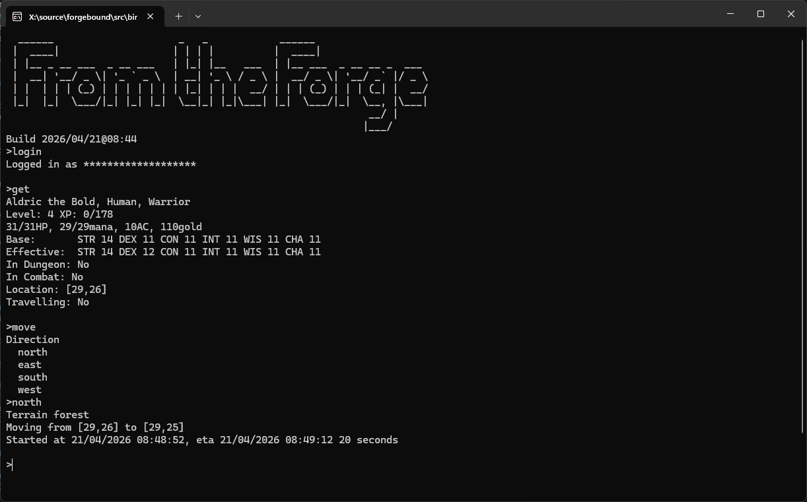

# Introduction

From The Forge is a simple command-line client for the REST driven RPG [ForgeBound.io](https://www.forgebound.io/).



# Download

Compiled downloads are not available.

# Compiling

To clone and run this application, you'll need [Git](https://git-scm.com) and [.NET](https://dotnet.microsoft.com/)
installed on your computer. From your command line:

```
# Clone this repository
$ git clone https://github.com/btigi/fromtheforge

# Go into the repository
$ cd src

# Build  the app
$ dotnet build
```

# Usage

Run FromTheForge.exe from a command-line, e.g.

`FromTheForge`

Use the `help` command to get a list of all available commands. Consult [ForgeBound.io](https://www.forgebound.io/) for more information.


# Licencing

From The Forge is licenced under the MIT license. Full licence details are available in
license.md